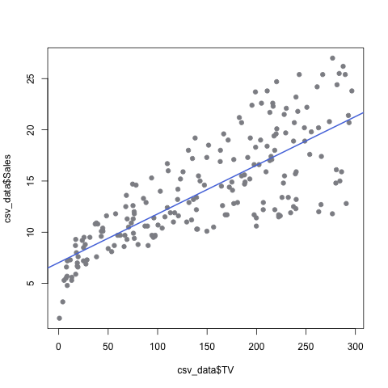

## Abstract
In this report, we reproduce the main results displayed in section 3.1 _Simple Linear Regression_ (chapter 3) of the book *[An Introduction to Statistical Learning](http://www-bcf.usc.edu/~gareth/ISL/)*.

## Introduction
The overall goal is to provide insights about whether advertising through different tunnels improves sales. In this report, we specifically look at how TV advertisement affects sales number. If an association exists between TV advertising and sales, then we want to build an accurate linear model that can be used for sales prediction based on TV advertising budget.

## Data
The [advertising dataset](http://www-bcf.usc.edu/~gareth/ISL/Advertising.csv) consists of _Sales_(in thousands of units) of a particular product in 200 different markets, along with advertising budgets (in thousands of dollars) for the product in each of those markets for three different media (_TV_, _Newspaper_ and _Radio_). And for this report specifically, we try to discover the association between _Sales_ and _Newspaper_ in our dataset.

## Methodology
We consider _Sales_ and _TV_ in our dataset and try to fit them in a simple linear regression model:
\begin{center}
$Sales = \beta_0 + \beta_1TV$
\end{\center}
And to find the values for the two coefficients $\beta_0$ and $\beta_1$, we fit the linear regression model based on the normal least square criterion.

## Results
We get the regression model's coefficients in Table 1 below:
```{r}
load(file = "../data/regression.RData")
s <- summary(reg)
library(xtable)
table <- xtable(s, caption = "Information about Regression Coefficients")
print(table)
```
From the table above, we can see that the slope of our linear model is around 0.0475 and the intercept point at 7.0326. This indicates that if TV advertisement increases by 1 million dollars, Sales will increase by around 47.5 thousands of units.

But in order to prove that this model is reliable, we need to see if our model is of high quality.
```{r}
sum_table_quantities <- c("Residual standard error", "R Squared", "F-Statistics")
sum_table_values <- c(s$sigma, s$r.squared, s$fstatistic[1])
sum_table_df <- data.frame(sum_table_quantities, sum_table_values)
colnames(sum_table_df) <- c("Quantity", "Value")
table2 <- xtable(sum_table_df, caption = "Regression Quality Indicies")
print(table2)
```
From the table above, we can see that the R squared is 0.61, which is a sign of correlatin between Y and X (in this case _Sale_ and _TV_). Even though this number is not very high, it works for this report because we don't have many data to train a better linear model. The residual standard error is the average amount that Y deviate from the true regression line, and that means the average deviation of sales from our predicted value is about 3260 units. The mean of Sales is about 14.0 thousand units, and this variation is almost 23.2%. Therefore this shows that the prediction of the trained linear model is not very reliable.

And we can see that the deviation becomes larger as X increases from the scatterplot graph.



## Conclusions
Our trained simple linear regression model can make relatively reliable prediction when _TV_ is small and the reliability of prediction decreases as _TV_ gets larger. This problem can be potentially solved by fitting in a larger dataset, remove outliers or use a different kinds of model that fits our dataset better. 